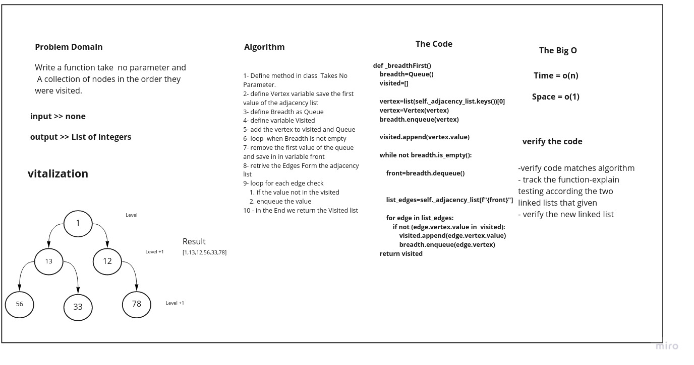

# Graphs

A graph is a non-linear data structure that can be looked at as a collection of vertices (or nodes) potentially connected by line segments named edges.

## Challenge

Implement your own Graph. The graph should be represented as an adjacency list, and should include the following methods:

* add node
    * Arguments: value
    * Returns: The added node
    * Add a node to the graph
* add edge
    * Arguments: 2 nodes to be connected by the edge, weight (optional)
    * Returns: nothing
    * Adds a new edge between two nodes in the graph
    * If specified, assign a weight to the edge
    * Both nodes should already be in the Graph
* get nodes
    * Arguments: none
    * Returns all of the nodes in the graph as a collection (set, list, or similar)
* get neighbors
    * Arguments: node
    * Returns a collection of edges connected to the given node
        * Include the weight of the connection in the returned collection
* size
    * Arguments: none
    * Returns the total number of nodes in the graph

## Approach & Efficiency

* add_node :
    * time : O(1)
    * space : O(1)

* add_edge :
    * time : O(n)
    * space : O(n)

* get_nodes:
    * time: O(n)
    * space: O(n)

* get_neighbors:
    * time: O(n)
    * space: O(n)

* size:
    * time: O(1)
    * space: O(1)

## API
1. add node: add node to the graph with value of the input and return the node.

2. add edge: add edge between the two input nodes.

3. get nodes: returns all of the nodes in the graph.

4. get neighbors: return the edges and the weight to the input node.

5. size: returns the total number of nodes in the graph.

## WHiteboard:

