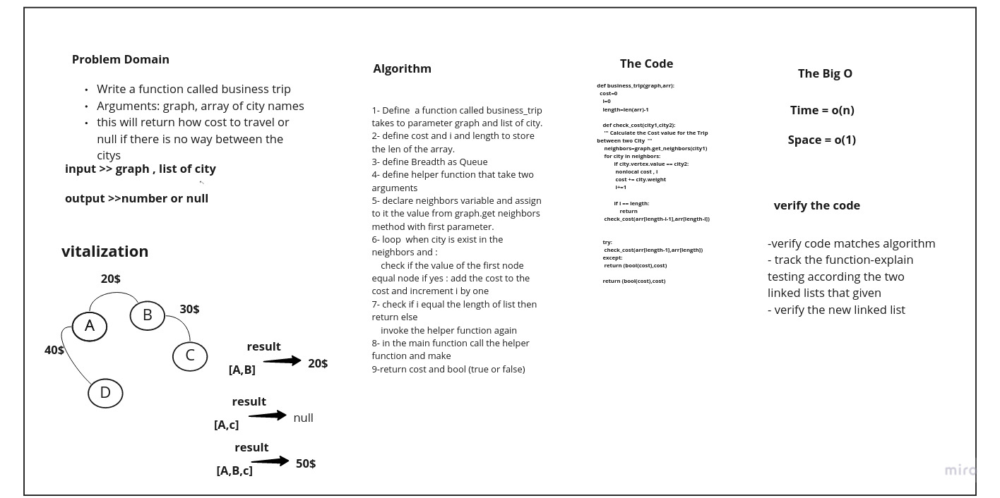

# Graph Trip
## Auther :  AbdullahELian
## Contiputer Anas abu ghalia and roaa mostafa

## Whiteboard

## Approach & Efficiency

the approach used assures that there is no edge case that can happen at all

    Define a counter and a boolean as True, the moment the boolean turns into false, this means that the trip can't be made.

    get all the nodes, and get the nodes related to the array, then store them inside the new array

    start a recursive function call, that takes two nodes at a time, determine if there is an edge between them, if exists, it adds the weight to the counter, if it doesn't exist, this will make bool false, and return false with $0 cost

    return the total cost

time complexity => O(n).

space complexity => O(1).

## Solution
'''
def business_trip(graph,arr):
    """
    Determine whether the trip is possible with direct flights, and how much it would cost.

    Args:
        graph (Graph): contains all the list of the cities and its cost
        arr (list): List of the cities
    Return
        tuple : (cost, Bool).

            cost: Total cost for Trip.
            Bool: True or False.

    """

    cost=0
    i=0
    length=len(arr)-1

    def check_cost(city1,city2):
     ''' Calculate the Cost value for the Trip between two City  '''
     neighbors=graph.get_neighbors(city1)
     for city in neighbors:
            if city.vertex.value == city2:
             nonlocal cost , i
             cost += city.weight
             i+=1

            if i == length:
                return
     check_cost(arr[length-i-1],arr[length-i])

    try:
     check_cost(arr[length-1],arr[length])
    except:
     return (bool(cost),cost)

    return (bool(cost),cost)
'''
