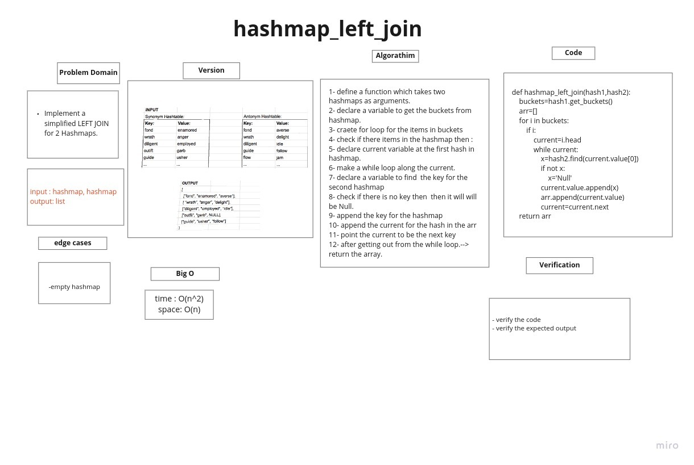

# Hashmap LEFT JOIN
## Challenge Summary

function called left join

Arguments: two hash maps

Implement a simplified LEFT JOIN for 2 Hashmaps
## Whiteboard Process

## Approach & Efficiency
Time--> O(n^2)
space--> O(n)

## Solution
'''
def hashmap_left_join(hash1,hash2):

    buckets=hash1.get_buckets()
    arr=[]
    for i in buckets:
        if i:
            current=i.head
            while current:
                x=hash2.find(current.value[0])
                if not x:
                    x='Null'
                current.value.append(x)
                arr.append(current.value)
                current=current.next
    return arr
'''
