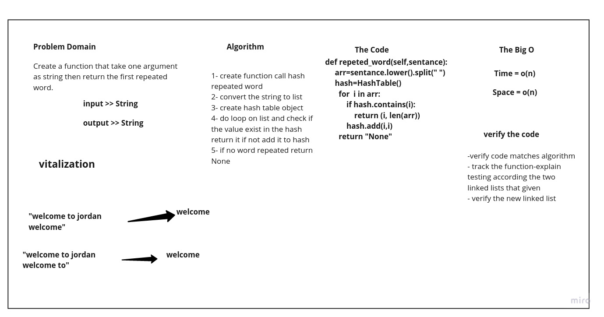

# Hash Table:
Hashtables are a data structure that utilize key value pairs. This means every Node or Bucket has both a key, and a value.

## Challenge

add

Arguments: key, value
Returns: nothing
This method should hash the key, and add the key and value pair to the table, handling collisions as needed.

get

Arguments: key
Returns: Value associated with that key in the table

contains
Arguments: key
Returns: Boolean, indicating if the key exists in the table already.
hash
Arguments: key
Returns: Index in the collection for that key

## Approach & Efficiency

Big O Notation

Time: O(1)

Space: O(N)

## Hash Table Reapeated Word:
Create a function that take one argument as string then return the first repeated word.

## Whiteboard Process

## Solution
'''
def repeted_word(self,sentance):
    arr=sentance.lower().split(" ")
    hash=HashTable()
    for  i in arr:
        if hash.contains(i):
            return (i, len(arr))
        hash.add(i,i)
    return "None"

'''

## Approach & Efficiency

Big O Notation

Time: O(n)

Space: O(n)

## Auther :
Abdullah ELian
