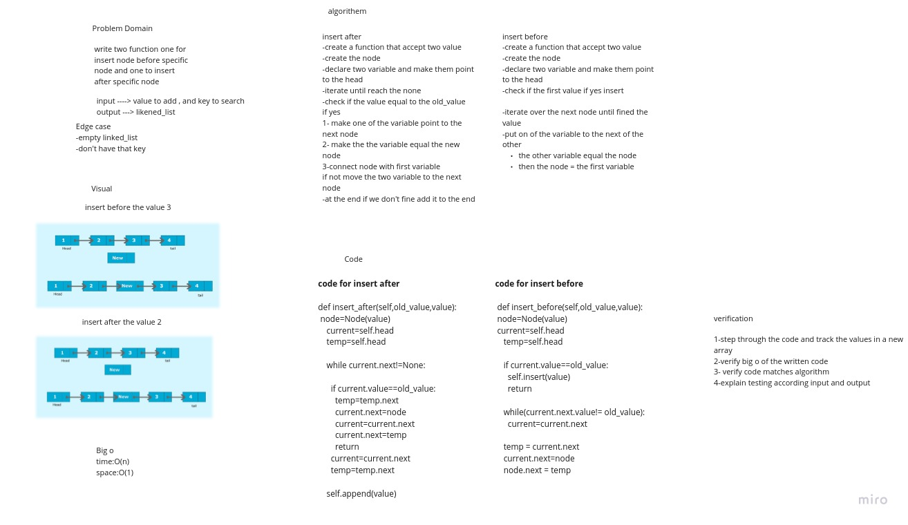
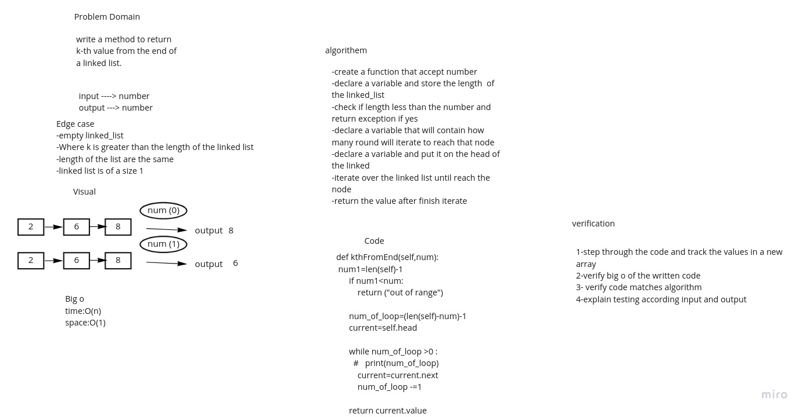
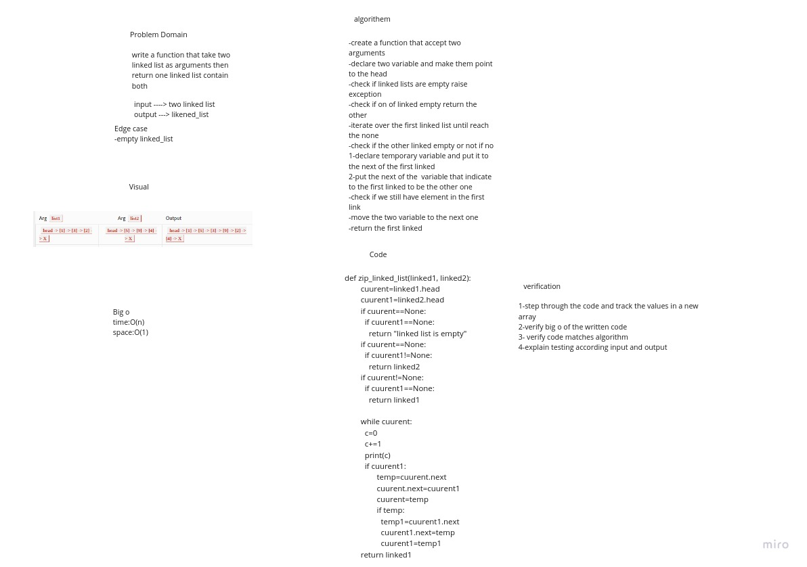

# Singly Linked List

Linked list is a sequence of Nodes that are connected linked to each other
List is that each Node references the next Node in the link

# Description of the challenge

to do functionality  for linked list like insert to insert new node also find to search in the linked and to print all node in the linked.

# code challeng 6

do three function on for add node to the last of the linked_list

and on to add after specific node and one to add before

# codechallenge 7

do function to return the value from the end of the linked list example

if the number was 0 will return the last element and if was one will return before the last one

# code challenge 8:

write a function that take two linked list as arguments then return one linked list contain both

