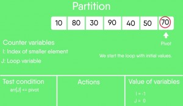
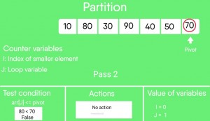
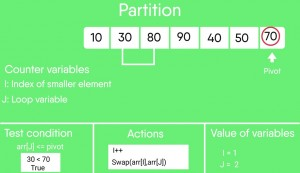
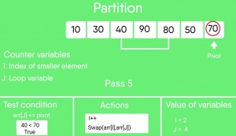
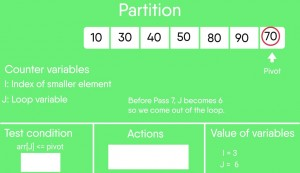
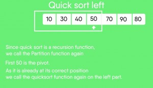
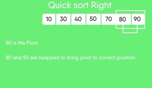

# Quick Sort

Quick sort is similar to merge sort, in that it's a conquer and divide style sorting algorythm. It chooses a pivot value and partitions the input array into a left and right array.


## Pseudocode

```
ALGORITHM QuickSort(arr, left, right)
    if left < right
        // Partition the array by setting the position of the pivot value
        DEFINE position <-- Partition(arr, left, right)
        // Sort the left
        QuickSort(arr, left, position - 1)
        // Sort the right
        QuickSort(arr, position + 1, right)

ALGORITHM Partition(arr, left, right)
    // set a pivot value as a point of reference
    DEFINE pivot <-- arr[right]
    // create a variable to track the largest index of numbers lower than the defined pivot
    DEFINE low <-- left - 1
    for i <- left to right do
        if arr[i] <= pivot
            low++
            Swap(arr, i, low)

     // place the value of the pivot location in the middle.
     // all numbers smaller than the pivot are on the left, larger on the right.
     Swap(arr, right, low + 1)
    // return the pivot index point
     return low + 1

ALGORITHM Swap(arr, i, low)
    DEFINE temp;
    temp <-- arr[i]
    arr[i] <-- arr[low]
    arr[low] <-- temp


```
## Trace

Sample Array: [10,80,30,90,40,50,70]


### Pass 1:




### Pass 2:




### Pass 3:





### Pass 4:




### Pass 5:




### pass 6


### pass 7


### pass 8




## Efficency

### Time: O(n^2)

### Space: O(1)
