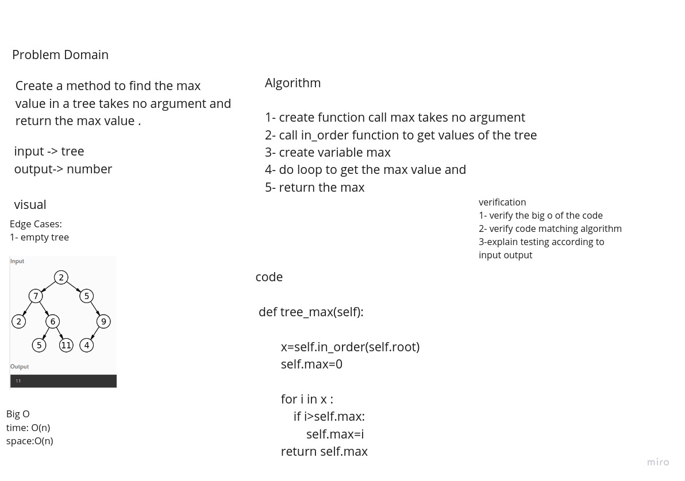
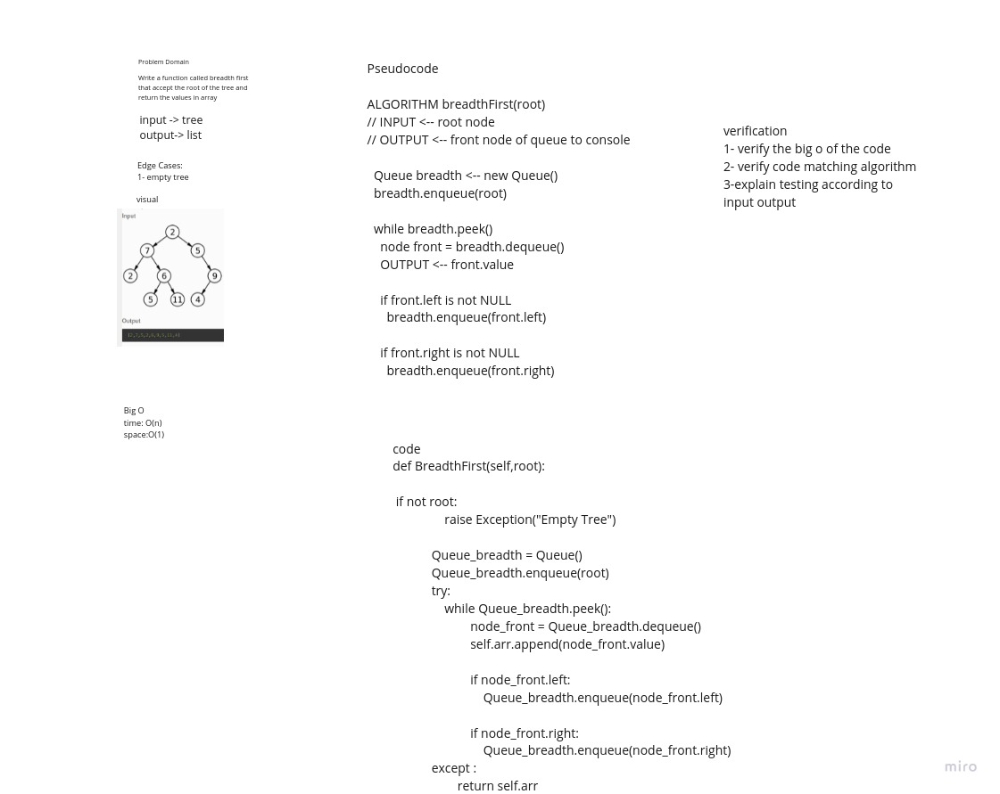

Pull Request Breadth First:https://github.com/AbdullahElian1/data-structures-and-algorithms/pull/36

# Trees

The repo about  Binary Trees, Binary Search Trees implementation

## Challenge

Trees are non-linear data structures that represent nodes connected by edges. Each tree consists of a root node as the Parent node, and the left node and right node as Child nodes.

### Binary Tree

+ Create a Binary Tree class
+ Define a method for each of the depth first traversals
+ Any exceptions or errors that come from your code should be semantic, capture-able errors. For example, rather than a default error thrown by your language, your code should raise/throw a custom, semantic error that describes what went wrong in calling the methods you wrote for this lab.

### Binary Search Tree

 + Create a Binary Search Tree class
 + Add
 + Contains

## Approach & Efficiency

for today's approach, i used only one method to complete today's code challenge, which is using regression inside the methods in order to loop over the entire tree, it's impossible to use a while or for loop in a multi-directional problem, that's why i used regression.

we have three classes, Tree, Node and Binary_Search_Tree.

# White bored

# Breadth Tree

